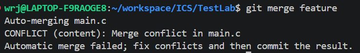
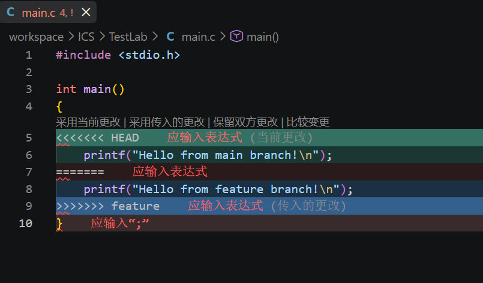
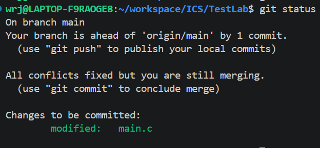
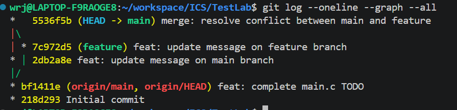

# Lab0 GitLab 实验报告

姓名：___吴睿杰____  
学号：___25303050022____  
仓库地址：<https://github.com/wrjhh061/TestLab>

## 一、Git 基础问题回答

### 1. 你之前有过多人协同开发的经历吗？如果有，你们是使用什么方式分工协作的？

目前我还没有比较正式的多人协同开发经历，之前更多是个人完成代码或作业。因此在这次 Lab 中，我主要通过 Git 的分支、提交和合并流程来理解多人协作时可能遇到的问题。例如不同成员可能同时修改同一个文件的同一位置，这时 Git 无法自动判断应该保留哪一份修改，就会产生合并冲突，需要开发者手动处理。

之后如果参与多人项目，我认为可以采用“主分支保持稳定、功能分支独立开发”的方式进行协作。每个人在自己的分支上完成特定功能，提交后再合并到主分支或开发分支；在合并前通过 `git pull`、代码检查和测试减少冲突。这样可以让不同成员的工作互不干扰，也方便追踪每个人的修改记录。

### 2. Git 为什么要设计“暂存-提交”两个步骤？

Git 设计“暂存区”和“提交”两个步骤，是为了让一次提交更加清晰、可控。修改代码时，我们可能同时改了多个文件，但这些修改不一定属于同一个逻辑任务。如果没有暂存区，只能把所有当前修改一次性提交，提交记录就容易变得混乱。

有了暂存区后，可以先用 `git add` 选择这次真正想提交的内容，再用 `git commit` 生成一次完整的历史记录。这样一次 commit 可以尽量只对应一个明确的修改目的，例如“完成 main.c 中 TODO 的修改”或“解决 merge conflict”。这不仅方便自己之后回看，也方便别人理解项目变化。

暂存区还提供了一个检查和缓冲的机会。提交前可以通过 `git status` 或 `git diff --staged` 查看将要提交的内容，避免把临时文件、调试代码或无关修改提交进去。因此，“暂存-提交”虽然多了一步，但可以提高提交质量。

### 3. `git branch` 和 `git branch -a` 的区别是什么？

`git branch` 默认只显示本地分支，也就是当前仓库中已经存在于本地的分支。例如本实验中如果创建了 `feature` 分支，那么 `git branch` 可以看到 `main` 和 `feature`。

`git branch -a` 会显示所有分支，包括本地分支和远程跟踪分支。远程分支通常会以 `remotes/origin/...` 的形式出现，例如 `remotes/origin/main`。因此，如果想看本地有哪些分支，用 `git branch` 就够了；如果还想看远程仓库上有哪些分支，可以使用 `git branch -a`。

## 二、实验步骤

### 1. 创建并克隆个人仓库

首先，我根据课程提供的模板仓库，在 GitHub 上创建了个人实验仓库 `wrjhh061/TestLab`。随后将仓库克隆到本地：

```bash
git clone git@github.com:wrjhh061/TestLab.git
cd TestLab
```

克隆完成后，我使用 `ls` 查看仓库文件，确认其中包含 `main.c`、`Makefile` 等模板文件。

### 2. 配置 Git 基本信息

为了让提交记录能够正确显示作者信息，我检查并配置了 Git 用户名和邮箱：

```bash
git config --global user.name "自己的用户名"
git config --global user.email "自己的邮箱@example.com"
```

配置后通过下面的命令检查：

```bash
git config --global user.name
git config --global user.email
```

### 3. 修改 `main.c` 中的 TODO 并提交

打开 `main.c` 后，我修改了 TODO 处的输出语句，将模板中的 `Hello, world!` 改为：

```c
printf("Hello, ICS! I am learning Git.\n");
```

修改完成后，我将本次修改加入暂存区并提交：

```bash
git add main.c
git commit -m "feat: complete main.c TODO"
```

检查程序是否能正常编译和运行，执行：

```bash
make
./main
make clean
```

### 4. 创建 `feature` 分支并进行修改

接着，我创建并切换到 `feature` 分支：

```bash
git switch -c feature
```

在 `feature` 分支上，我将同一处输出语句修改为：

```c
printf("Hello from feature branch!\n");
```

然后提交本次修改：

```bash
git add main.c
git commit -m "feat: update message on feature branch"
```

### 5. 回到 `main` 分支并制造冲突

为了满足实验要求，我切换回 `main` 分支：

```bash
git switch main
```

然后在 `main` 分支上将 `main.c` 中与 `feature` 分支相同的位置修改为：

```c
printf("Hello from main branch!\n");
```

随后提交：

```bash
git add main.c
git commit -m "feat: update message on main branch"
```

由于两个分支都修改了同一个文件的同一位置，后续合并时 Git 无法自动判断应该采用哪一份修改，因此会产生冲突。

### 6. 合并 `feature` 分支并解决冲突

在 `main` 分支上执行：

```bash
git merge feature
```

此时终端提示 `CONFLICT (content): Merge conflict in main.c`，说明冲突已经成功产生。打开 `main.c` 后，可以看到类似下面的冲突标记：

```c
<<<<<<< HEAD
printf("Hello from main branch!\n");
=======
printf("Hello from feature branch!\n");
>>>>>>> feature
```

我手动编辑该文件，删除冲突标记，并保留最终想要的输出内容：

```c
printf("Hello from both main and feature branches!\n");
```

解决后再次提交：

```bash
git add main.c
git commit -m "merge: resolve conflict between main and feature"
```

最后使用下面的命令查看提交历史和分支合并情况：

```bash
git log --graph --oneline --all
```

### 7. 添加实验报告并推送到 GitHub

完成本实验报告后，我将 `report.md` 放入仓库，在 `main` 分支上提交并推送：

```bash
git add report.md
git commit -m "Add lab0 report"
git push origin main
```

## 三、必要截图

### 截图 1：合并时产生冲突



### 截图 2：`main.c` 中的冲突标记



### 截图 3：冲突解决结果



### 截图 4：解决冲突后的完整提交历史



## 四、阅读材料概括

### 1. Git Flow 分支控制

《Git Flow 分支控制》主要介绍了在团队开发中如何通过分支管理来组织代码。文章把分支分为长期分支和临时分支：`master` 分支用于保存稳定的线上版本，`develop` 分支用于日常开发，`feature` 分支用于开发单个新功能，`release` 分支用于发布前测试和修复，`hotfix` 分支用于紧急修复线上问题。本文使用 `master` 这一名称，而本实验仓库对应的稳定分支名为 `main`。

这篇文章给我的主要启发是，分支并不是随便创建的，而是应该有明确职责。比如新功能从 `develop` 切出 `feature` 分支，完成后合并回 `develop`；`release` 分支完成发布准备后需要合并到稳定分支和 `develop`；线上紧急问题则从稳定分支切出 `hotfix`，修复后同样合并回相关长期分支。这样可以减少不同工作的互相影响，让开发、测试和发布过程更清楚。

### 2. 语义化版本

《语义化版本 2.0.0》主要说明了软件版本号应该如何表达软件变化。语义化版本采用 `主版本号.次版本号.修订号` 的格式，也就是 `MAJOR.MINOR.PATCH`。当出现不兼容的 API 修改时增加主版本号；当新增向下兼容的功能时增加次版本号；当进行向下兼容的问题修复时增加修订号。

文章还提到，使用语义化版本的软件应先定义清楚公共 API；正式发布后的版本内容不应再被修改，如需修改，应发布新版本。主版本号或次版本号增加时，较低位的版本号需要归零。语义化版本还支持先行版本号和构建信息，例如 `1.0.0-alpha` 和 `1.0.0+20130313144700`。这种规则让使用者可以从版本号本身判断升级风险，尤其是在项目存在依赖关系时非常重要。

## 五、为什么要学习 Git

通过这次实验和两篇阅读材料，我认为学习 Git 主要有以下几个原因。

第一，Git 可以保存项目的修改历史。相比手动复制文件夹或保存多个“最终版”，Git 的提交记录更加清晰，也可以随时查看每次修改的内容和原因。当代码出现问题时，可以回到之前的版本进行排查。

第二，Git 能帮助多人协作。实际项目中，不同成员经常会同时修改代码。如果没有版本控制工具，合并修改会非常困难，也容易覆盖别人的工作。Git 通过分支、合并、冲突提示等机制，让协作过程更有秩序。

第三，Git 可以配合 GitHub 等平台完成远程备份和作业提交。对于课程实验来说，把代码推送到 GitHub 后，老师和助教可以直接查看提交历史和最终代码；对于真实项目来说，远程仓库也方便团队成员同步代码。

第四，Git 也是理解软件工程流程的基础。Git Flow 说明了一个项目如何从开发、测试到发布；语义化版本说明了版本号如何反映软件变化。这些内容不只是 Git 命令本身，也是在学习如何更规范地管理一个项目。

## 六、实验总结

本次 Lab 主要让我熟悉了 Git 和 GitHub 的基本使用流程，包括克隆仓库、修改文件、暂存、提交、创建分支、合并分支、解决冲突和推送远程仓库。实验中最重要的部分是理解分支合并冲突的产生原因：当两个分支修改了同一文件的同一位置时，Git 无法自动判断最终结果，需要人工处理。

通过这次实验，我也进一步理解了提交记录的重要性。清晰的 commit message 可以让项目历史更容易阅读；合理使用分支可以降低开发过程中的混乱程度。以后完成课程实验时，我会尽量保持“完成一个明确任务就提交一次”的习惯，并在提交前先检查 `git status`，避免提交无关文件。

